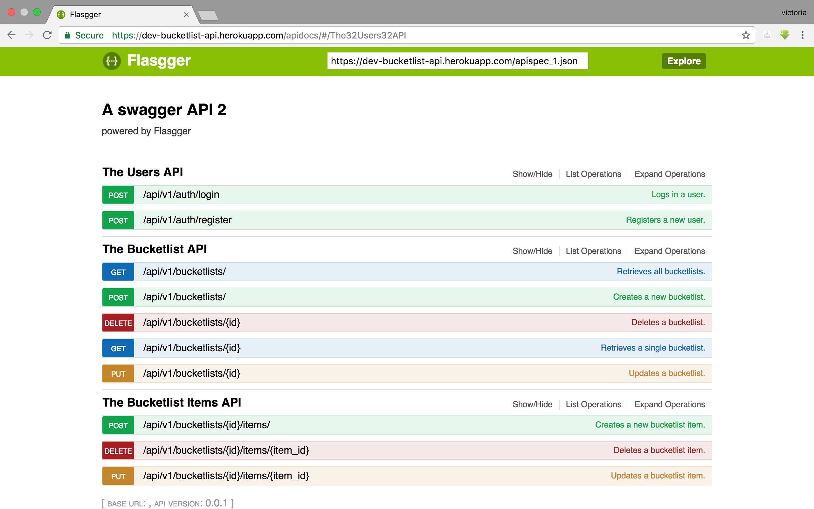

## Bucketlist API <br />[](https://travis-ci.org/victoriaaoka/Checkpoint2-Bucketlist) [](https://coveralls.io/github/victoriaaoka/Checkpoint2-Bucketlist?branch=tasks)

### Introduction
According to Merriam-Webster Dictionary,  a Bucket List is a list of things that one has not done before but wants to do before dying.

Bucketlist API is an online flask API that can help users to create, edit and track their bucketlists.

### Installation and Setup
Clone the repository.
```
https://github.com/victoriaaoka/Checkpoint2-Bucketlist.git
```
Navigate to the root folder.
```
cd Checkpoint2-Bucketlist
```
Install the requirements.
```
pip install -r requirements.txt
```
Initialize, migrate and upgrade the database.
```
python manage.py db init
python manage.py db migrate
python manage.py db upgrade
```
### Launch the progam.
```
python manage.py runserver
```
Interact with the API by sending http requests using Postman.
### API Endpoints
| URL Endpoint | HTTP Methods | Description |
| -------- | ------------- | --------- |
| `/api/v1/auth/register` | `POST`  | Register a new user|
|  `/api/v1/auth/login` | `POST` | Login and retrieve token|
| `/api/v1/bucketlists/` | `POST` | Create a new Bucketlist |
| `/api/v1/bucketlists/` | `GET` | Retrieve all bucketlists for user |
| `/api/v1/bucketlists/?limit=3` | `GET` | Retrieve three bucketlists per page |
 `/api/v1/bucketlists/?q=name` | `GET` | search a bucketlist by the name|
| `/api/v1/bucketlists/<id>` | `GET` |  Retrieve a bucketlist by ID|
| `/api/v1/bucketlists/<id>` | `PUT` | Update a bucketlist |
| `/api/v1/bucketlists/<id>` | `DELETE` | Delete a bucketlist |
| `/api/v1/bucketlists/<id>/items/` | `POST` |  Create items in a bucketlist |
| `/api/v1/bucketlists/<id>/items/<item_id>` | `DELETE`| Delete an item from a bucketlist|
| `/api/v1/bucketlists/<id>/items/<item_id>` | `PUT`| update a bucketlist item details|

### API documentation
The API has been documented using flasgger and the online version can be found [here](https://dev-bucketlist-api.herokuapp.com/apidocs/#/).

### Screenshots

#### The screenshot below shows the documented API as hosted on heroku.


#### The screenshots below show sample requests.
User registration:


User login:


Create a bucketlist:
